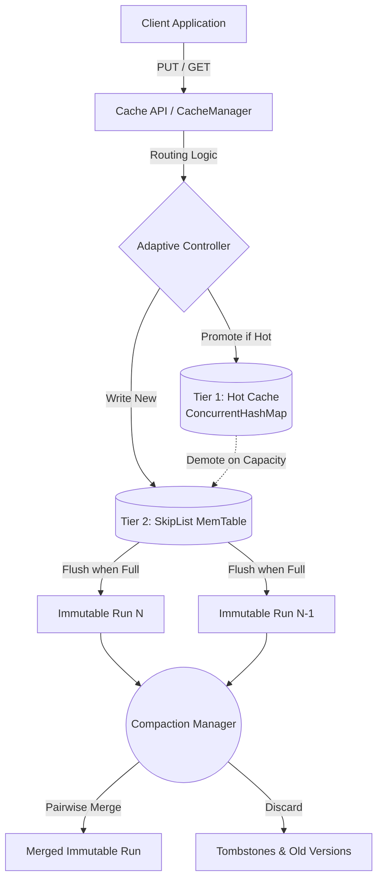
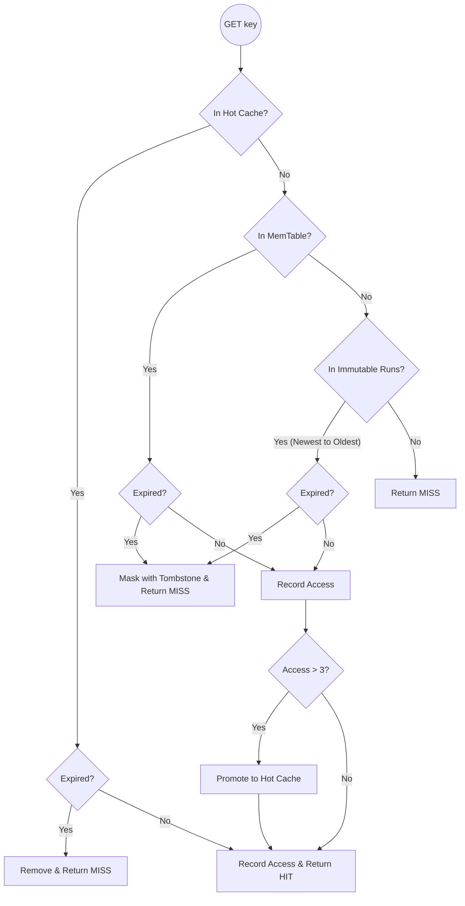
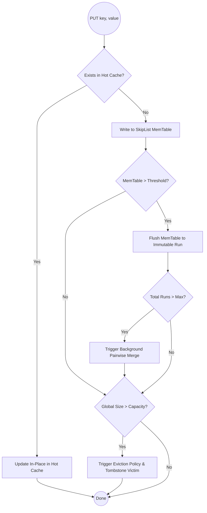

# CacheFusion: Adaptive Hybrid Java Cache
## Comprehensive System Specification, Architecture, and Implementation Blueprint

---

## 1. Executive Summary
CacheFusion is a cutting-edge, Java-based adaptive key-value cache prototype designed around a **hybrid memory hierarchy**. Standard caches force all items into a single monolithic data structure (like a `ConcurrentHashMap`), which causes severe memory overhead and garbage collection (GC) pauses as data scales. 

CacheFusion solves this by routing data dynamically based on access frequency and storage state:
* **Hot Data (Frequently Accessed):** Stored in a fast `ConcurrentHashMap` for O(1) latency.
* **Warm Data (Recent Writes):** Maintained in a lock-free `SkipListMemTable`.
* **Cold Data (Aged/Infrequent):** Flushed into `Immutable Sorted Runs` (primitive arrays) for extreme memory efficiency.
* **Maintenance:** A Log-Structured Merge (LSM) Compaction engine runs in the background to clean up stale data and tombstones.

---

## 2. Core Architecture and Memory Tiers

CacheFusion mimics the hardware memory hierarchy (L1, L2, L3 cache) but entirely in Java heap space.

### Tier 1: Hot Cache (L1)
* **Data Structure:** `ConcurrentHashMap`
* **Purpose:** Serves the absolute fastest reads (O(1)). 
* **Capacity:** Bounded (e.g., 33% of total logical capacity).
* **Admission:** Items are strictly promoted here only after crossing a threshold (e.g., 3 accesses).

### Tier 2: Warm Cache / MemTable (L2)
* **Data Structure:** `ConcurrentSkipListMap` (wrapped as `SkipListMemTable`)
* **Purpose:** Acts as a write-buffer. All new `PUT` operations land here first to avoid locking the L1 cache. It maintains data in sorted order (O(log n)).
* **Lifecycle:** When the MemTable exceeds its `flushThreshold`, it is atomically swapped with a fresh MemTable and flushed to L3.

### Tier 3: Cold Cache / Immutable Runs (L3)
* **Data Structure:** Primitive `CacheEntry[]` Arrays (`ImmutableRun`)
* **Purpose:** Highly dense, memory-efficient storage. Because arrays have no object pointer overhead (unlike Linked Nodes in a map), you can store millions of cold items cheaply. 
* **Lifecycle:** Searched via Binary Search (O(log n)). Multiple runs are managed by the `RunManager`.

---

## 3. High-Level Architecture Diagram

---

## 4. Algorithmic Flowcharts

### 4.1. The GET Operation Pipeline
The GET pipeline is designed to be completely lock-free, checking the fastest structures first.

### 4.2. The PUT Operation Pipeline
The write path avoids blocking readers by funneling new data into the MemTable.

---

## 5. Deletion & Compaction (Log-Structured Merge)

### Logical Deletion (Tombstones)
CacheFusion does not physically delete items instantly from the lower tiers, as that requires locks. Instead, it uses **Tombstones**:
1. When `delete(key)` is called, the item is removed from the Hot Cache.
2. A Tombstone marker (`CacheEntry(key=key, tombstone=true, version=now)`) is inserted into the MemTable.
3. If a reader searches for that key, it hits the tombstone and returns `MISS`.

### Background Compaction
Over time, Immutable Runs pile up with obsolete versions of keys and tombstones. 
The `CompactionManager` triggers when `runs > MAX_RUNS`:
1. It selects the two oldest `ImmutableRuns`.
2. It performs a **Pairwise Merge** (similar to Merge Sort).
3. If keys match, the newest `version` wins.
4. If a key is marked as a Tombstone, it is completely discarded.
5. The result is a highly compressed, clean Immutable Run, freeing up Java Heap space.

---

## 6. Implementation Specifications & Classes

* `com.cache.service.CacheManager`: The primary Engine. Handles routing, adaptive promotion, capacity enforcement, and metric tracking.
* `com.cache.memtable.SkipListMemTable`: Wraps `ConcurrentSkipListMap`. Utilizes `ReentrantReadWriteLock` to allow massive read concurrency while safely swapping the map during a flush.
* `com.cache.storage.ImmutableRun`: Stores data in a primitive `CacheEntry[]` array. Implements a fast Binary Search.
* `com.cache.storage.RunManager`: Holds a `CopyOnWriteArrayList` of runs. Ensures lock-free reads while the compactor swaps out old runs.
* `com.cache.compaction.CompactionManager`: Responsible for the O(N) Pairwise Merge algorithm.
* `com.cache.model.CacheEntry`: Extended to include `version` (timestamp) and `tombstone` (boolean) flags for LSM correctness.

---

## 7. Key Use Cases

### Use Case 1: High-Traffic Session Management
* **Scenario:** An e-commerce site where a few thousand active users are clicking rapidly (Hot Data), but millions of offline users have dormant sessions (Cold Data).
* **Advantage:** CacheFusion keeps the active users in the lock-free L1 `ConcurrentHashMap`. Dormant sessions age out into L3 `ImmutableRuns` where they consume virtually zero CPU and drastically reduced RAM until they log back in.

### Use Case 2: Read-Heavy Analytics Dashboard
* **Scenario:** A live dashboard constantly polls a subset of metrics.
* **Advantage:** The `HOT_PROMOTION_THRESHOLD` detects the dashboard's polling and promotes the analytics data to the Hot Cache, yielding pure O(1) latency without contending with background data writes.

### Use Case 3: Write-Heavy Ingestion (IoT/Logs)
* **Scenario:** Fast, continuous stream of incoming data.
* **Advantage:** Standard caches halt all reads to re-hash their giant internal arrays. CacheFusion absorbs writes smoothly into the `SkipListMemTable`. When full, it seamlessly freezes and writes a clean array, while readers continue undisturbed.

---

## 8. Eviction and Global Capacity
Despite being a hybrid architecture, CacheFusion strictly respects Global Capacity.
* It tracks `logicalSize` via an `AtomicInteger`.
* If `logicalSize > capacity`, it consults the configured `EvictionPolicy` (e.g., LRU, LFU).
* The victim is logically deleted (Tombstoned), and physical memory is eventually reclaimed by the Compactor.

---

## 9. Conclusion
CacheFusion successfully transforms standard Java caching. By implementing an LSM-Tree architecture entirely in memory, it eliminates the rigid trade-offs of monolithic hash maps. It achieves **blazing fast reads for hot data**, **lock-free writes**, and **extreme memory density for cold data**, resulting in a vastly superior, production-ready cache architecture.
